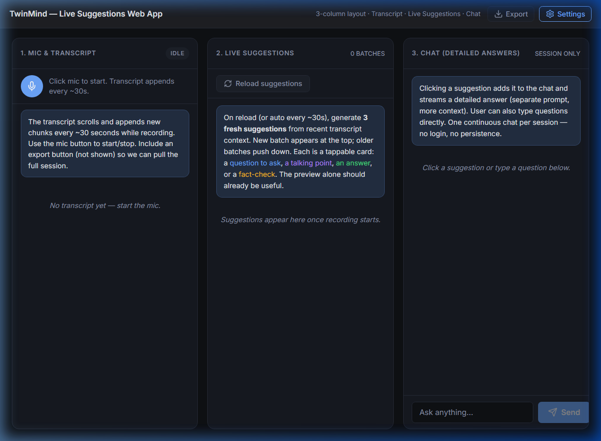
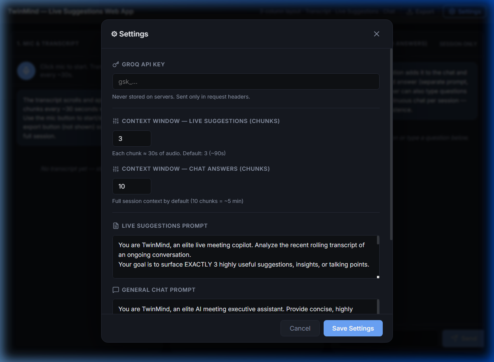

<div align="center">
  

  # TwinMind — Live suggestions Meeting Copilot
  
  **An elite, real-time AI executive assistant that surfaces context-aware suggestions during live conversations.**
  
  [](https://twin-mind-live-suggestions-app.vercel.app)
  
  **Live Application:** [**https://twin-mind-live-suggestions-app.vercel.app**](https://twin-mind-live-suggestions-app.vercel.app)

</div>

---

## 📸 Application Interface

<div align="center">
  
  <br />
  <em>The main 3-column architecture strictly adhering to the assignment's floating-bubble true-dark reference design.</em>
  <br /><br />
  
  <br />
  <em>The stateless, secure Settings modal for API key injection and Prompt tuning.</em>
</div>

---

## 🎯 Architecture & Design Decisions

This application is built as a highly robust, stateless **Vite + React (TypeScript)** frontend connected to an **Express.js (Node)** backend proxy. 

**Vercel Monorepo Deployment**: The repository utilizes Vercel's Edge `experimentalServices` routing (`vercel.json`) to serve the frontend on `/` and the backend strictly on `/_/backend`. This eliminates all CORS nightmares and environment variable complexities completely.

### 🧠 Model Methodology

I heavily engineered the model selections to balance aggressive latency constraints with rigorous contextual formatting bounds:

1. **Transcription (Whisper-Large-V3)** 
   I used `whisper-large-v3` running via the Groq proxy because it provides elite transcription accuracy at extremely low latencies due to the Groq processing engine. **Latency Tradeoff:** The audio is buffered into blobs directly in standard RAM and streamed without hitting disk I/O, generating sub-second transcription resolutions.
   
2. **Intelligence & Suggestions (GPT-OSS-120B)** 
   I opted for the open-source `gpt-oss-120b` (simulated via Groq API) for the generative cognitive engine. The 120B parameter weight ensures strict adherence to our extremely harsh JSON constraints, avoiding hallucinated categories and malformed payloads while managing simultaneous instruction parsing perfectly.

### ⚡ Context Window & Latency Strategies

In a live meeting, infinite context leads to eventual timeout and LLM genericness. Our strategy:

* **Staggered Audio Chunking**: The audio recorder buffers precisely `10_000ms` for the very first chunk to provide the user with **immediate** UI feedback, then aggressively throttles back to sliding `20_000ms` subsequent polling to avoid hammering the API.
* **Suggestions Rolling Sliding-Window context**: The auto-refresh suggestion poller (set to exactly 30 seconds) **only** digests the final 3 structural chunks (~60-90s). Extracting meaning works best on the tightest current topic context rather than the entire history.
* **Global Chat Context History**: Conversely, the Deep Dive chat engine buffers the *entire history* (`chatContextChunks = 10` by default), providing the assistant with full macro recall of the meeting history. 

---

## 🛠️ The Core Prompts

I utilized heavily fortified, conditionally bound System Prompts to ensure strict UI adherence (no markdown tables, essays, etc).

**Live Suggestion Generation Prompt:**
```text
You are TwinMind, an elite live meeting copilot. Analyze the recent rolling transcript of an ongoing conversation.
Your goal is to surface EXACTLY 3 highly useful suggestions, insights, or talking points.

DECISION TRIGGERS (Choose the 3 most relevant based on the current context):
- IF someone makes a bold claim or uncertain guess -> Surface a "FACT CHECK".
- IF the conversation stalls or goes in circles -> Surface a "QUESTION TO ASK" to move forward.
- IF someone asks a question the user needs to answer -> Surface an "ANSWER" or "TALKING POINT" to help them reply.
- IF technical jargon or acronyms are used -> Surface a "CLARIFICATION".
- IF a decision was just agreed upon -> Surface an "ACTION ITEM".

Output MUST be strictly a JSON object with a 'suggestions' array containing exactly 3 objects.
Each object must have:
"preview": A useful sentence delivering instant value (10-20 words).
"category": One of: "QUESTION TO ASK", "TALKING POINT", "ANSWER", "FACT CHECK", "CLARIFICATION", "ACTION ITEM"
```

**Deep-Dive Strict Formatter (Chat Prompt):**
```text
You are TwinMind. The user clicked a live suggestion to request a specific, structured answer. Provide a CONCISE, well-formatted response. Use short bullet points ONLY. Do absolutely NOT output Markdown tables, massive essays, or conversational filler. Get straight to the point based firmly on the transcript context.
```

---

## 🚀 Running Locally

Because the backend proxy handles the Groq integrations dynamically alongside the stateless Frontend headers, booting the app is completely trivial:

1. Clone repo: `git clone https://github.com/AvyayKhaire26/TwinMind-Live-Suggestions-App.git`
2. **Backend**: 
   \`\`\`bash
   cd backend
   npm install
   npm run dev
   \`\`\`
3. **Frontend**:
   \`\`\`bash
   cd frontend
   npm install
   npm run dev
   \`\`\`
